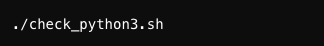

# T1A3-Terminal-Assignment
# Shift Management System

## Link to GitHub repository:
https://github.com/shgil1/T1A3-Terminal-Assignment.git

## Overview:
- This Python app is designed to allow employees to log and track their shifts. It provides functionalities to add shifts, calculate total hours worked for an entire week or a specific day and display all shifts for a logged-in employee. 

## Table of Contents
- [Features](#features)
  - [User menu option](#user-menu-option)
  - [Add shift](#add-shift)
  - [Display all shifts](#display-all-shifts)
  - [Calculate total weekly hours worked](#calculate-total-weekly-hours-worked)
  - [Calculate total hours from a specific date](#calculate-total-hours-from-a-specific-date)
  - [Error handling](#error-handling)
  - [Save to JSON file ](#save-to-json-file)
  - [Load data from JSON file](#load-data-from-json-file)
- [Code Style Guide](#code-style-guide)
- [Implementation Plan](#implementation-plan)
- [Help Documentation](#help-documentation)
- [References](#references)

## Features
- 'FILE_PATH' variable is defined outside any function making it globally accessible and allows it to be used by any function needing to access the file path for loading or saving shifts

### User Menu Options
- Upon starting the application, users are presented with a clear and conscise menu detailing 5 options to choose from
- Users can navigate through these options by entering the number corresponding to their choice, making it easy to use 
- After selecting an option and completing the action, the users are brought back to the main menu which allows them the option to select another function or exit the app
- The menu system uses a loop that continues to display the options until the user selects number 5 to exit the app
- Conditional statements (if, elif, else) inside the loop react to user input to call the appropriate functions
- 'first_name', 'last_name' variables store the users first and last name and are collated once at the beginning of session to ensure that all data added or compiled during the session is specific to that employee. They are defined within the 'main()' function making them local to this function and are not accessible when 'main()' exits
- 'options' is a string variable that holds the text for the user menu options
- 'choice' is a variable used to capture the user's menu selection
- 'while true' loop is used to continually display menu until the user chooses option 5 to exit menu and the loop breaks
- 'if-elif-else' structures used to process menu selection from 1-5 and 'else' handles any input that is not a valid choice, and displays an error message to prompt the user to input a valid number

### Add shift
- Users are able to input their rostered shift hours and specify the date, start and end times
- The user will input their first and last name, date and start/end times for a shift. The app will then calculate the hours worked based on the start and end times and then save the shifts to the JSON file
- 'shift' variable is the dictionary that represents newly added shifts that includes attributes of employee's name, shift date, start/end times and hours worked. It is created and returned by the 'add_shift()' function and used locally within the 'if' block
- 'date', 'start_time', 'end_time', 'hours_worked', 'first_name' and 'last_name' are all variables collected within the 'add_shift()' function and defined locally and then returned to the global 'shifts' list which is defined outside the 'main()'
- 'add_shift()' uses conditional statements by requiring input validation via 'validate_input()' function to ensure the data is in the correct format before accepting the data

### Display all shifts
- Users are able to select from the menu to see all shifts for the current logged-in employee
- The app will filter all the shifts to match those with the name of the logged-in employee and display them
- 'employee_shifts' is a locally defined variable within the scope of the user menu option to display shifts, it filers the 'shifts' list to only show shifts relevant to the logged-in employee based on the 'first_name' and 'last_name' provided at login
- If-else structure is used in the 'display_shifts' function to check if there are any shifts to display

### Calculate total weekly hours worked
- Calculates the total hours worked in one week from Monday to Sunday containing a specified date that is inputted by the user
- Adjusts the provided data to identify the week as starting on a Monday and ending on Sunday then calculates hours worked for shifts falling within that week
- 'date_str' is the string input by the user representing the date from which to start the weekly calculation
- 'start_date' and 'end_date' variables within the function define the range of the week for which hours are calculated 
- 'total_hours' accumulates the total hours worked within the specified week, it's used within the loop that iterates over shifts and sums up the hours
- 'date_str', 'start_date', 'end_date', 'total_hours' are local to the 'calculate_total_hours' function

### Calculate total hours from a specific date
- Users can input a date and see how many hours they worked on that specific date
- 'specific_date' is derived from the 'date_str' input and is a variable that represents the date converted into a 'datetime' object, which allows calculation against other dates in the 'shifts' data. It is defined locally within the function 'total_hours' that calculates the total hours worked
- Condtitional statements are used within the loop to check if the date of each shift is greater than or equal to the 'specific_date' function to ensure correct calculation

### Error handling
- Input validation ensures that users input match expected format

#### 1. 'validate_date_format':
        - Ensures users can only input correct data in the format of dd/mm/yyyy
        - Utilises try block to parse 'date_str' into 'datetime.datetime' object using 'date_str, "%d/%m/%Y"' to check format is correct and returns a boolean
        - Utilises except block to catch any errors to prevent app from crashing 

#### 2. 'validate_time_format':
        - Ensures users can only input correct data of HHMM
        - Utilises try block to parse 'date_str' into 'datetime.datetime' object using 'date_str, "%H%M"' to check format is correct and returns a boolean
        - Utilises except block to catch any errors to prevent app from crashing 

#### 3. 'validate_name_format':
        - Ensures users can only input alphabetic characters withut any spaces or numbers
        - Utilises conditional statements (if, else)
        - if false, the function executes an else block and prints an error message to users stating "Names can only contain alphabetic characters. Please do not include space or numbers."

### Save to JSON file 
- Save all user-entered shift data to an external JSON file so data is not lost when the application is closed 
- Collate all current shift data and convert into JSON format
- 'json.dump' is used to convert the list of dictionaries ('shifts_data') into JSON formatted string and write it directly to a file
- 'indent=4' makes it human-readable and provides consistency across the application 
- 'try-except' block catches and reports errors during file operations 

### Load data from JSON file 
- Retrieve previously saved shift data from JSON file
- Checks and reads the file, if the file exists then the application opens and reads the JSON file
- The reconstructed data is loaded and made available for use 
- 'if-else' statements are used to check the success of loading the JSON file 

## Code Style Guide

## Implementation plan in chronological order:

### Feature 1: Load data from JSON file
- Create a JSON file and relevant data
- Loading the data is the first step to set up the application with the necessary data and allows for immediate testing as existing shift data is available for processing and display right from the start
- Then start writing the file_operations.py and define load_shifts_from_file with the FILE_PATH parameter
- Utilising the example application demonstrated in the lecture as reference for how to correctly write this

### Feature 2: Save shifts to JSON file
- Implementing save functionality so the data that the user inputs will be immediately updated and saved to the JSON file 
- Creating this early will ensure that any data modified or added during development and testing isn't lost and can be used to test for errors
- Define save_shifts_to_file with the FILE_PATH parameter in file_operations.py 
- Utilising the example application demonstrated in the lecture as reference for how to correctly write this

### Feature 3: User Menu Option
- Create a user menu option and outline the core functionalities of the app

### Feature 4: Add Shift
- Core functionality that allows users to add new shift data 
- This will then add and save data to the JSON file 

### Feature 5: Display all shifts
- Once users add shift details, displaying all relevant shift details based upon the employee's name verifiys data

### Feature 6: Calculate total weekly hours worked
- This feature builds upon feature 3 and 4, allowing users to see a weekly calculation of hours they have worked once inputting a date that can be used for reports and analytics

### Feature 7: Calculate total hours worked
- Implementing this feature builds on the total weekly hours worked option but allows more flexibility in retrieving retrospective data

### Feature 8: Error handling for User input and File operations
- Conduct robust error handling and testing to ensure the app doesn't crash for critical errors and any invalid input information 

## Screenshots:
### Initial app idea layout on paper

### Trello:

### Flowchart of App:

## Help Documentation:
### Important Notes
- This application has been designed and tested on a Macbook and is only confirmed to work on Unix-like systems, this application has not been tested on Windows systems but presumably will work if Python 3 is installed. 
- Operation Systems required: MacOS X Mojave or later, Windows 10 or later, Ubuntu 18.09LTS or later
- Hardware required: At least 1GHz CPU, 512MB RAM, at least 100MB of free disk space
- Please create a seperate terminal window before beginning the application 

### Dependencies 
- To run this application, you must have python 3 installed. This application also requires the following dependencies that can be installed from Python's package installer pip:

- pytest==3.9.6
- datetime==3.9.6
- autopep8==3.9.6

### Installation
- To install this app, download the ZIP file named "SharlaGilbert_T1A3" and extract it
- Open your terminal and check if you have Python 3 installed by navigating to where the "check_install_python.sh" file is located

- If you do not have Python 3 installed, run the script prompted to install to your computer
- If you have any issues running the script, please enter the following command into your terminal to make the script executable 

### Using the application
- After launching the application you will be prompted to enter your first and last name 
- After inputting your name, you will be directed to the user name and greeted by your name
- You will be presented with a user menu that includes 5 options to choose from
- Use the numbers associated with each menu item to navigate through the application 

1. **Add a shift:** This option allows you to add a new shift by entering specific details and the app will record and save the shift 
- Select this option from the menu by pressing '1' and 'Enter'
- Follow the prompts to enter the date of the shift in the format DD/MM/YYYY, the start time in 24 hour format (HHMM) and the end start also in 24 hour time (HHMM)
- The app will use this data to calculate the hours worked based on the start and end times and save this shift 
- You will receive a confirmation message saying "Shift added successfully!" 
- You will then return to the main menu 

2. **Display my shifts:** This option allows you an overview of all the shifts you have entered into the system 
- Select this option from the menu by pressing '2' and 'Enter'
- The app will display all your recorded shifts including date, start/end time and total hours worked
- You will then return to the main menu 

3. **Calculate my total weekly hours:** This option will calculate and display the total number of hours you have worked in a week starting from any given date that you specify 
- Select this option from the menu by pressing '3' and 'Enter'
- You will be prompted to enter a date in the format DD/MM/YYYY which will be the starting point of the week for which the total hours worked will be calculated 
- The app will then calculate the total hours worked from that date to the end of the week and display the result 
- You will then return to the main menu 

4. **Calculate my total hours for a specific date:** This option will calculate and display the total hours you worked on a specific date 
- Select this option from the menu by pressing '4' and 'Enter'
- You will be prompted to enter a date in the format DD/MM/YYYY for which you want to calculate the hours worked 
- The app will then calculate and show the total hours worked on that day
- You will then return to the main menu

5. **Exit:** This option will allow you to exit the app completely 
- Select this option from the menu at any time to exit the app by pressing '5' and 'Enter' 
- You will receive a message saying 'Ok! Enjoy your day, see you next time!'
- The application will close

### Command line arguments
- This application supports several command line arguments that perform operations directly from the CLI without having to interact with user menu: 
1. '--add-shift': Directly adds a shift 
2. '--calculate-hours': Calculates the total hours for the current week or for a specific date if provided
3. '--display-shifts': Displays all previously recorded shifts 

## References
- Datetime - basic date and time types Python documentation. Available at: https://docs.python.org/3/library/datetime.html (Accessed: 25 June 2024).
- OS - miscellaneous operating system interfaces Python documentation. Available at: https://docs.python.org/3/library/os.html (Accessed: 25 June 2024).

## Code style guide or styling conventions that the application will adhere to (rerference chosen style guide appropriately)
- docstrings 

## Important things to note for the README:
- And generally, for the class: just remembering the portfolio submissions -- please, please, please, confirm that you can run your submission in its submission structure before submitting it. We can NOT edit your submissions. If your submission does not work for you, it will not work for us. 

- Part of the assessment is to write instructions on how to run your app - this is what those instructions should be for. 
If we have to cd into a specific directory to run things, make sure that's noted.

- If you feel like you have to completely rearrange your project to meet the submission structure: stop. Just make new folders for the submission ZIP, move your terminal project into the src folder of the submission folders, and make sure the instruction in the submission readme says to cd into the src/YourProjectHere folder.

[def]: #feature-1